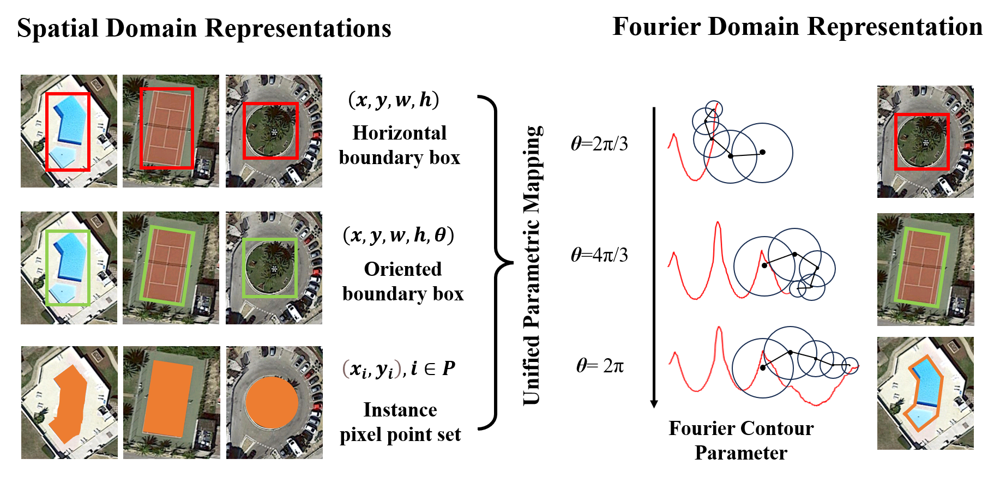

# A Unified Remote Sensing Object Detector Based on Fourier Contour Parametric Learning
         
> Tong Zhang, Yin Zhuang, Guanqun Wang, He Chen, Liang Chen, Lianlin Li      
> Under review on IEEE Transactions on Geoscience and Remote Sensing

## Updates

 - (April, 2024): This repository is built, and the dataset and code are coming soon!🚀
 - (July, 2024): We released part implementation codes, and the remaining codes would be released after accpecting the work.🌟
 - (July, 2024): The multi-grained self-built datasets Multi-grained DOTA and Multi-grained NV10 are released!🌟

## Abstract 
Nowadays, object detection has to give the locations and their specific categories corresponding to different parametric definitions, such as the horizontal bounding box (HBB), oriented bounding box (OBB) and instance segmentation (InSeg). However, the absence of unified, efficient and precise parametric definition would severely hinder the development of remote sensing object detection. Therefore, in order to establish a remarkable paradigm that can unify HBB, OBB and InSeg to promote the development of remote sensing object detection, a unified remote sensing detector called UniconDet is proposed, which is capable of coping with detection tasks with different parametric definitions. Firstly, aiming to construct a unified parameter mapping paradigm that can detect arbitrary-shaped objects, a new Fourier contour parametric modeling is designed to represent any contours in the frequency domain, which has the benefits of scale-invariance and robustness. Secondly, to advance the learning of a series of Fourier contour parameters, a multi-view cross attention is proposed. It utilizes spatial affine transformation to imitate the spectrum shift, and then build long range dependence between transformed views via cross attention. This allows to obtain the coupled discriminative information for promoting the Fourier domain-based parameter prediction. Thirdly, for fully exploiting the advantages of contour modeling based Fourier contour parametric learning, a center-contour enhancing regression layer is proposed to individually leverage regional guidance and cascade contour propagation to ensure accurate prediction of center and contour parameters. Finally, a great deal of experiments is executed on benchmarks of HBB, OBB, InSeg and self-built multi-grained detection tasks. And, these results prove that our proposed UniconDet can reach or approach sota-of-the-art (SOTA) performance.

## Highlights

- **Simple:** One-stage and Anchor-free: It only needs to detect center point and regress fourier degree.

- **Versatile:** A unifed detection framework works for horizontal bounding box-based object detection, oriented bounding box-based object detection, and instance segmentation.

- **Strong**: It achieves sota-of-the-art (SOTA) results in some datasets, such as DIOR, NWPUVHR-10 and iSAID.

- **Benchmark**: A novel multi-categories and -grained object detection benchamrk is built for laying the foundation for the practical application in real-world scenes.

## New Benchmark: Multi-categories and -grained Object Detection
- **Multi-grained DOTA**  is a mixed version of DOTA dataset, whose annotations range from high granularity to low granularity. In order to construct a dataset which has access to multiple annotation granularities, we selected specified annotation granularity for the instance of each category according to the characteristics of the objects. In practice, firstly, the soccer ball field (SBF), helicopter (H), ground track field (GTF) and swimming pool (SP) employ the format of HBB. And then, the bridge (B), small vehicle (SV), large vehicle (LV), ship (S), tennis court (TC), basketball court (BC) and harbor (HB) are annotated in the format of OBB. Next, the annotation of pixel-level instance mask is adopted for these categories including baseball diamond (BD), storage tank (ST), roundabout (R) and plane (P). Regarding the data split, it is the same with the DOTA dataset. The processed data is avaiable: .

- **Multi-grained NV10**  is also built by combining three annotation granularities of HBB, OBB and InSeg. However, due to the lack of the OBB version, the annotation of InSeg is adopted for expanding the OBB annotation, that is, calculating the bounding rectangle based on the pixel point set of each instance. And then, we followed the same data split to construct a mixed version of NV10. Regarding the allocation of annotation granularity, the airplane (AL) and baseball diamond (BD) are annotated in the format of InSeg. The ship (S), tennis court (TC), basketball court (BC), harbor (HB), bridge (B) and vehicle (V) are annotated in the format of OBB. Lastly, the ground track filed (GTF) and storage tank (ST) are selected for using the HBB annotation. The processed data is avaiable: .

